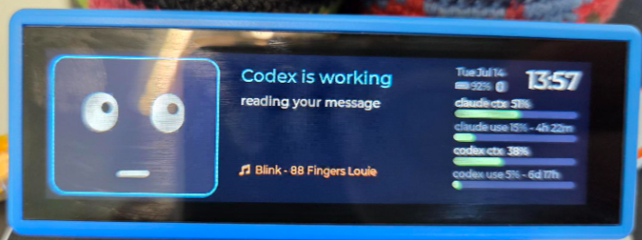
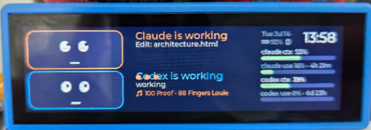
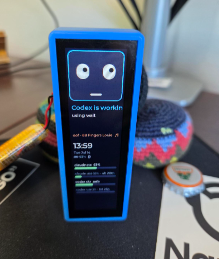
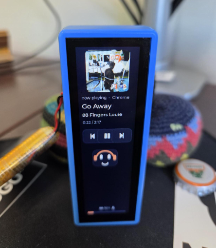

# Claude Buddy

A desk companion for the **Waveshare ESP32-S3-Touch-LCD-3.49** (172x640 bar
display). Two little animated faces live on the display — one for Claude
Code, one for OpenAI's Codex CLI — and react to whatever each is doing on
your Windows PC, plus official/local usage limits, context-window gauges,
clock, battery and PC stats. Works over USB or Bluetooth LE (battery
powered).

<p align="center">
  
</p>

## Screens (tap to cycle)

1. **Buddy** — animated face(s) + status + clock/date/battery + Claude and
   Codex context/usage gauges; a ♪ ticker with the current track while music
   plays. Whichever engine is idle steps aside so the active one gets the
   full face; if both are busy at once, the two faces stack (shrunk), each
   with its own status line — see "Dual-face layout" below
2. **Zen clock** — big clock
3. **Claude usage** — official numbers from Anthropic's usage API:
   5-hour block, weekly all-models, weekly current-model, with reset times
4. **Codex usage** — Codex CLI's own rate-limit window (a single bar, not
   the 5-hour/weekly pair Claude has) plus its context-window breakdown
5. **PC stats** — CPU and RAM
6. **Now playing** — album art, track/artist, smooth progress bar, working
   ⏮ ⏯ ⏭ buttons (controls Spotify, YouTube, anything with a Windows media
   card), and a headphoned buddy that sways, blinks and twirls to the music

| Buddy (working) | Claude usage | PC stats | Now playing |
|:---:|:---:|:---:|:---:|
|  |  |  |  |

| Codex solo | Both stacked |
|:---:|:---:|
|  |  |

### Dual-face layout

Claude's face keeps its full 6-mood range (idle/working/waiting/happy/error/
sleep) and its original hardware-verified geometry. Codex gets its own
face — permanently blue-outlined (identity color, not mood-reactive) and a
deliberately reduced mood set (working / done / idle only — there's no
reliable "needs approval" signal in Codex's session logs to drive a waiting
mood). `update_dual_layout()` in `firmware/src/buddy_ui.cpp` arbitrates
between them every status frame:
- neither/Claude-only active → Claude's face full-size (today's original
  look, unchanged)
- Codex-only active → Codex's face takes the same full-size slot
- both active → both shrink and stack, each with a compact status line

**Gotcha for future edits here:** `apply_mood()`/`apply_codex_mood()` only
ever reset eye/mouth *size*, never their alignment/position offset — that's
set once at construction and was never expected to change. The dual/stacked
view's `scale_face_shapes()` *does* move eyes/mouth inward as well as
shrinking them (needed to fit the smaller box). So the solo-view branches of
`update_dual_layout()` must explicitly call `scale_face_shapes(..., 1.0f)`
with the mood's canonical geometry (from `claude_mood_geom()`/
`codex_mood_geom()`) to restore *both* size and position — calling
`apply_mood()` alone is not enough and will leave a face's eyes pulled
inward/mouth mispositioned if it was ever in the stacked view.

Long-press the face to pet the buddy. **Swipe down** on the buddy screen to
peek the album art (it also peeks automatically on every track change).
While music plays and the buddy is idle, it bobs its head along.

**Stand it any way you like** — the onboard IMU detects orientation and the
UI reflows automatically: landscape (either way up) or portrait (either end
down) with vertical layouts for all six screens. Axis notes: the panel's
long axis is accelerometer X; Y's sign distinguishes the two landscapes
(the desk stand's back-lean puts ~0.7 g on Y).

| Portrait — buddy | Portrait — now playing |
|:---:|:---:|
|  |  |

## Moods

**Claude**: blinks and looks around when idle; focuses with typing dots
while working; wide-eyed amber when waiting on you (permission prompt);
smiles when a task finishes; frowns on errors; sleeps with dimmed backlight
when the companion is offline.

**Codex**: reduced set (see "Dual-face layout" above) — flat mouth + focused
pupils while working, smile when idle or a task just finished. No
waiting/error moods (no reliable signal for those in Codex's session logs).

Toast notifications slide in for usage warnings (80% / 95%) and anything
pushed over the serial protocol.

## Layout

```
Desktop Buddy/
├── firmware/     PlatformIO project (ESP32-S3, LVGL 9, NimBLE)
│   └── flash.bat     build + flash (uses pio.exe directly)
└── companion/    Windows-side Python app
    ├── buddy_companion.py   main app (run_buddy.bat launches it)
    ├── buddy_hook.py        Claude Code hook → event bridge
    └── buddy.log            runtime log (gitignored)
```

## Setup

**Firmware** (already flashed; for updates):
```powershell
cd firmware
.\flash.bat        # PowerShell/cmd only — Git Bash breaks the toolchain installer
```
First-time flash on a factory board: hold BOOT, tap PWR, release BOOT.
After that, flashing needs no buttons.

**Companion**: runs from a self-contained virtualenv at `.venv/` (not your
system Python — the login environment can't see user-installed packages
reliably). One-time setup: `python -m venv .venv` then
`.venv\Scripts\pip install -r companion\requirements.txt`. After that:

| Action | How |
|---|---|
| Start (silent) | double-click `companion\start_buddy_hidden.vbs` |
| Start (visible console) | double-click `companion\run_buddy.bat` |
| Stop | double-click `companion\stop_buddy.bat` |
| Automatic | already installed in `shell:startup` — starts itself at login |

It auto-detects the board on USB (Espressif VID) and falls back to
Bluetooth LE ("ClaudeBuddy", Nordic UART service) when unplugged — with a
30 s heartbeat that forces a reconnect if the link goes silent. Log:
`companion\buddy.log`.

**Battery**: hold PWR ~2 s to power on (firmware latches power via the
TCA9554 expander), hold ~3 s to power off. Battery %, charge state and
USB/BLE link show top-right on every screen.

## Data sources

| What | Where it comes from |
|---|---|
| Official 5-hour / weekly limits | `GET api.anthropic.com/api/oauth/usage` with the OAuth token from `~/.claude/.credentials.json` (polled every 5 min; token auto-refreshed via `platform.claude.com/v1/oauth/token` and persisted back) |
| Live mood / tool activity | Claude Code hooks (PreToolUse, UserPromptSubmit, Notification, Stop) registered in `~/.claude/settings.json` → `buddy_hook.py` → `~/.claude/buddy_events.jsonl` |
| Context-window gauge | Last assistant turn's token usage in the newest transcript (`~/.claude/projects/**/*.jsonl`); window is 1M for every current model except Haiku (200k) |
| Token totals / fallback gauge | Transcript parsing (5-hour blocks; limit auto-estimated, override in `companion/buddy_config.json`: `{"block_limit_tokens": N}`) |
| Daily cost | Claude Code OpenTelemetry → companion's OTLP listener on `127.0.0.1:4318` (env vars in `~/.claude/settings.json`) |
| Codex context/usage/activity | `CodexWatcher` in `companion/buddy_companion.py` tails the newest `~/.codex/sessions/YYYY/MM/DD/rollout-*.jsonl` — no API/OAuth needed. Per-turn `token_count` events give context fill (`last_token_usage`, **not** `total_token_usage` — that's a cumulative session total and can exceed the context window) and OpenAI's own rate-limit % (`rate_limits.primary.used_percent`). Activity state is mtime-based (same `ACTIVE_WINDOW`/`DONE_WINDOW` idea as Claude, no hook-file equivalent exists for Codex) |
| Now playing + controls | Windows system media API (SMTC, `winrt` packages) — any app with a media card, no service API keys. Position is extrapolated from the player's last report (web players freeze theirs). Album art: thumbnail → 120×120 RGB565, streamed in paced base64 chunks |

**Secrets:** nothing sensitive lives in this folder. OAuth tokens stay in
`~/.claude/.credentials.json`; hook events in `~/.claude/`; the OTel
listener binds to localhost only. `buddy.log` (activity text) is gitignored.

## Serial/BLE protocol (one JSON per line, same on both transports)

```jsonc
{"t":"s","cpu":31,"ram":62,"clk":"14:32","date":"Wed Jul 09",
 "claude":"working","head":"Claude is working","msg":"Edit: main.cpp",
 "proj":"my-app","ctx":32,"ctxt":"323k / 1.0M",
 "use":{"pct":56,"rst":"4h 19m","blk":"38M tok","day":"41M tok · $12.40",
        "w":38,"wrst":"Jul 12","wm":61},
 "cdx":{"ctx":24,"ctxt":"63k / 258k","pct":3,"rst":"6d 20h",
        "state":"working","head":"Codex is working","msg":"using wait",
        "proj":"my-app"},
 "med":{"st":"playing","t":"Song","a":"Artist","app":"Spotify",
        "pos":143,"dur":221}}
{"t":"n","kind":"ok","msg":"Build finished"}      // toast: ok | err | info
{"t":"art","w":120,"h":120,"seq":0,"n":60,"d":"<base64>"}  // album art chunks
{"t":"ping"}                                       // → {"t":"pong","fw":"..."}
```
`claude` states: `working`, `waiting`, `done`, `error`, `idle`, `sleep`.
`cdx.state`: `working`, `done`, `idle` only (see "Moods" above for why).
Buddy → PC: `hello` on boot, `pong`, `pet`, `mc` (media command:
play/next/prev), `artok`/`artdrop` (art transfer receipts).
30 s without frames → sleep mood.

## Troubleshooting

- **Build fails with `'xtensa-esp32s3-elf-g++' is not recognized`** — build
  from PowerShell/cmd, never Git Bash (MSys breaks the toolchain installer).
- **`python -m platformio` says "No module named platformio"** — your shell's
  `%APPDATA%` is redirected; use `flash.bat` (hardcodes the pio.exe path).
- **Buddy stuck "waiting for companion"** — check `companion\buddy.log`;
  the heartbeat reconnects within ~90 s, or restart `run_buddy.bat`.
- **Weekly bars empty** — the OAuth token needs one successful refresh;
  check the log for "usage API" lines.
- **Short PWR press flashes static then dies** — normal near-empty battery
  behavior; charge over USB.
- **Touch feels rotated** — mapping in `firmware/src/lvgl_port.c`
  (`TouchInputReadCallback`).
- **Tapping a screen doesn't cycle to the next one** — LVGL's `lv_bar`
  widget is clickable by default, so a screen mostly covered by bars (PC
  stats, both usage screens) can swallow taps before they reach the
  screen's page-cycle handler. Every bar clears `LV_OBJ_FLAG_CLICKABLE`
  now (`make_hbar()` and the four buddy-screen mini bars) — if a new bar
  gets added anywhere, clear that flag on it too.
- **Factory firmware restore** — prebuilt binaries in the
  [vendor repo](https://github.com/waveshareteam/ESP32-S3-Touch-LCD-3.49)
  (`Firmware/` folder).

## Feature ideas / roadmap

- Battery-saver mood on BLE (dimmer backlight, slower updates)
- Pomodoro timer screen (touch to start/stop)
- Build/test results pushed as toasts from CI
- Speech bubble showing Claude's last reply summary
- Wi-Fi mode (companion streams over TCP, no BT needed)

**Considered and shelved:** sound/speech output. The board's ESP32-S3 has
onboard mic (dual mic array + ES7210 ADC) and an audio codec DAC (ES8311),
but no built-in speaker — audio out needs an external speaker wired to the
board's MX1.25 header, which Rick doesn't want to do. A Bluetooth speaker
isn't an option either: ESP32-S3 only implements Bluetooth *LE*, and A2DP
(what's needed to stream audio to a BT speaker) requires Classic Bluetooth,
which this chip doesn't have at all — not a config issue, the radio mode
just isn't there. If this comes back: the PC-side companion already has a
real speaker and full Bluetooth, so playing sounds from there (triggered by
the same events that already drive the screen) is the path of least
resistance, not the board itself.
