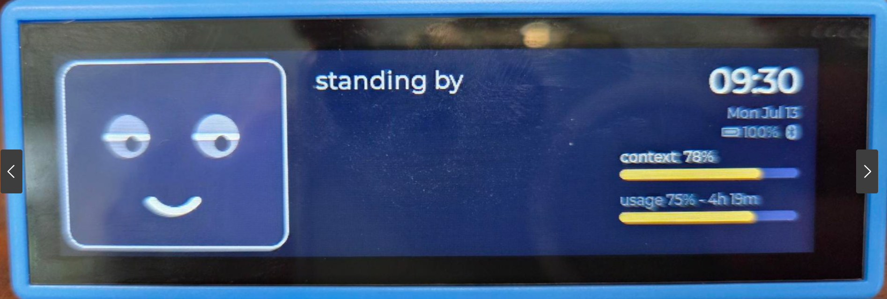
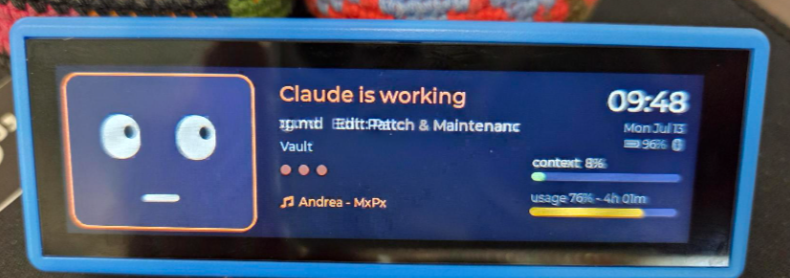
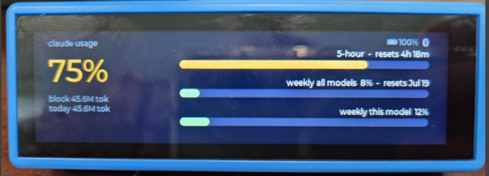
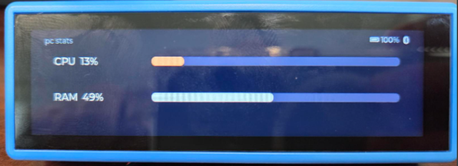
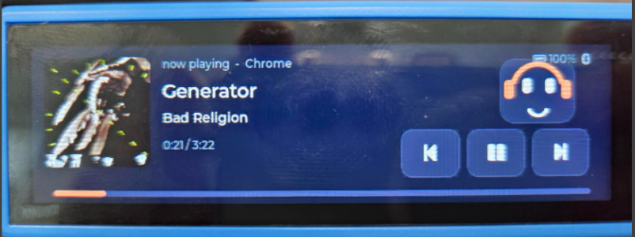

# Claude Buddy

A desk companion for the **Waveshare ESP32-S3-Touch-LCD-3.49** (172x640 bar
display). A little animated face lives on the display and reacts to what
Claude Code is doing on your Windows PC — plus your official Claude usage
limits, context-window gauge, clock, battery and PC stats. Works over USB or
Bluetooth LE (battery powered).

<p align="center">
  
</p>

## Screens (tap to cycle)

1. **Buddy** — animated face + Claude status + clock/date/battery + context
   and usage gauges; a ♪ ticker with the current track while music plays
2. **Zen clock** — big clock
3. **Claude usage** — official numbers from Anthropic's usage API:
   5-hour block, weekly all-models, weekly current-model, with reset times
4. **PC stats** — CPU and RAM
5. **Now playing** — album art, track/artist, smooth progress bar, working
   ⏮ ⏯ ⏭ buttons (controls Spotify, YouTube, anything with a Windows media
   card), and a headphoned buddy that sways, blinks and twirls to the music

| Buddy (working) | Claude usage | PC stats | Now playing |
|:---:|:---:|:---:|:---:|
|  |  |  |  |

Long-press the face to pet the buddy. **Swipe down** on the buddy screen to
peek the album art (it also peeks automatically on every track change).
While music plays and the buddy is idle, it bobs its head along.

**Stand it any way you like** — the onboard IMU detects orientation and the
UI reflows automatically: landscape (either way up) or portrait (either end
down) with vertical layouts for all five screens. Axis notes: the panel's
long axis is accelerometer X; Y's sign distinguishes the two landscapes
(the desk stand's back-lean puts ~0.7 g on Y).

## Moods

Blinks and looks around when idle; focuses with typing dots while Claude
works; wide-eyed amber when Claude is waiting on you (permission prompt);
smiles when a task finishes; frowns on errors; sleeps with dimmed backlight
when the companion is offline. Toast notifications slide in for usage
warnings (80% / 95%) and anything pushed over the serial protocol.

## Layout

```
Desktop Buddy/
├── firmware/     PlatformIO project (ESP32-S3, LVGL 9, NimBLE)
│   └── flash.bat     build + flash (uses pio.exe directly)
└── companion/    Windows-side Python app
    ├── buddy_companion.py   main app (run_buddy.bat launches it)
    ├── buddy_hook.py        Claude Code hook → event bridge
    └── buddy.log            runtime log (gitignored)
```

## Setup

**Firmware** (already flashed; for updates):
```powershell
cd firmware
.\flash.bat        # PowerShell/cmd only — Git Bash breaks the toolchain installer
```
First-time flash on a factory board: hold BOOT, tap PWR, release BOOT.
After that, flashing needs no buttons.

**Companion**: runs from a self-contained virtualenv at `.venv/` (not your
system Python — the login environment can't see user-installed packages
reliably). One-time setup: `python -m venv .venv` then
`.venv\Scripts\pip install -r companion\requirements.txt`. After that:

| Action | How |
|---|---|
| Start (silent) | double-click `companion\start_buddy_hidden.vbs` |
| Start (visible console) | double-click `companion\run_buddy.bat` |
| Stop | double-click `companion\stop_buddy.bat` |
| Automatic | already installed in `shell:startup` — starts itself at login |

It auto-detects the board on USB (Espressif VID) and falls back to
Bluetooth LE ("ClaudeBuddy", Nordic UART service) when unplugged — with a
30 s heartbeat that forces a reconnect if the link goes silent. Log:
`companion\buddy.log`.

**Battery**: hold PWR ~2 s to power on (firmware latches power via the
TCA9554 expander), hold ~3 s to power off. Battery %, charge state and
USB/BLE link show top-right on every screen.

## Data sources

| What | Where it comes from |
|---|---|
| Official 5-hour / weekly limits | `GET api.anthropic.com/api/oauth/usage` with the OAuth token from `~/.claude/.credentials.json` (polled every 5 min; token auto-refreshed via `platform.claude.com/v1/oauth/token` and persisted back) |
| Live mood / tool activity | Claude Code hooks (PreToolUse, UserPromptSubmit, Notification, Stop) registered in `~/.claude/settings.json` → `buddy_hook.py` → `~/.claude/buddy_events.jsonl` |
| Context-window gauge | Last assistant turn's token usage in the newest transcript (`~/.claude/projects/**/*.jsonl`); window is 1M for every current model except Haiku (200k) |
| Token totals / fallback gauge | Transcript parsing (5-hour blocks; limit auto-estimated, override in `companion/buddy_config.json`: `{"block_limit_tokens": N}`) |
| Daily cost | Claude Code OpenTelemetry → companion's OTLP listener on `127.0.0.1:4318` (env vars in `~/.claude/settings.json`) |
| Now playing + controls | Windows system media API (SMTC, `winrt` packages) — any app with a media card, no service API keys. Position is extrapolated from the player's last report (web players freeze theirs). Album art: thumbnail → 120×120 RGB565, streamed in paced base64 chunks |

**Secrets:** nothing sensitive lives in this folder. OAuth tokens stay in
`~/.claude/.credentials.json`; hook events in `~/.claude/`; the OTel
listener binds to localhost only. `buddy.log` (activity text) is gitignored.

## Serial/BLE protocol (one JSON per line, same on both transports)

```jsonc
{"t":"s","cpu":31,"ram":62,"clk":"14:32","date":"Wed Jul 09",
 "claude":"working","head":"Claude is working","msg":"Edit: main.cpp",
 "proj":"my-app","ctx":32,"ctxt":"323k / 1.0M",
 "use":{"pct":56,"rst":"4h 19m","blk":"38M tok","day":"41M tok · $12.40",
        "w":38,"wrst":"Jul 12","wm":61},
 "med":{"st":"playing","t":"Song","a":"Artist","app":"Spotify",
        "pos":143,"dur":221}}
{"t":"n","kind":"ok","msg":"Build finished"}      // toast: ok | err | info
{"t":"art","w":120,"h":120,"seq":0,"n":60,"d":"<base64>"}  // album art chunks
{"t":"ping"}                                       // → {"t":"pong","fw":"..."}
```
`claude` states: `working`, `waiting`, `done`, `error`, `idle`, `sleep`.
Buddy → PC: `hello` on boot, `pong`, `pet`, `mc` (media command:
play/next/prev), `artok`/`artdrop` (art transfer receipts).
30 s without frames → sleep mood.

## Troubleshooting

- **Build fails with `'xtensa-esp32s3-elf-g++' is not recognized`** — build
  from PowerShell/cmd, never Git Bash (MSys breaks the toolchain installer).
- **`python -m platformio` says "No module named platformio"** — your shell's
  `%APPDATA%` is redirected; use `flash.bat` (hardcodes the pio.exe path).
- **Buddy stuck "waiting for companion"** — check `companion\buddy.log`;
  the heartbeat reconnects within ~90 s, or restart `run_buddy.bat`.
- **Weekly bars empty** — the OAuth token needs one successful refresh;
  check the log for "usage API" lines.
- **Short PWR press flashes static then dies** — normal near-empty battery
  behavior; charge over USB.
- **Touch feels rotated** — mapping in `firmware/src/lvgl_port.c`
  (`TouchInputReadCallback`).
- **Factory firmware restore** — prebuilt binaries in the
  [vendor repo](https://github.com/waveshareteam/ESP32-S3-Touch-LCD-3.49)
  (`Firmware/` folder).

## Feature ideas / roadmap

- Battery-saver mood on BLE (dimmer backlight, slower updates)
- Pomodoro timer screen (touch to start/stop)
- Build/test results pushed as toasts from CI
- Speech bubble showing Claude's last reply summary
- Wi-Fi mode (companion streams over TCP, no BT needed)
